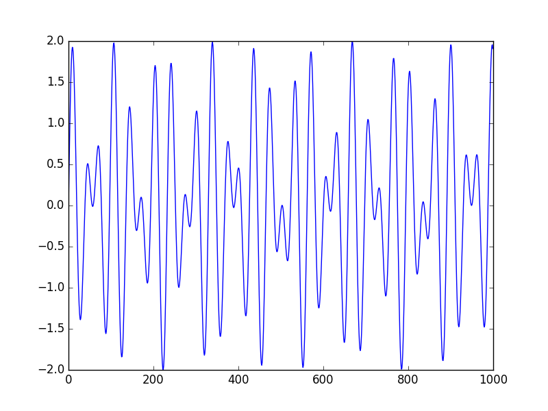
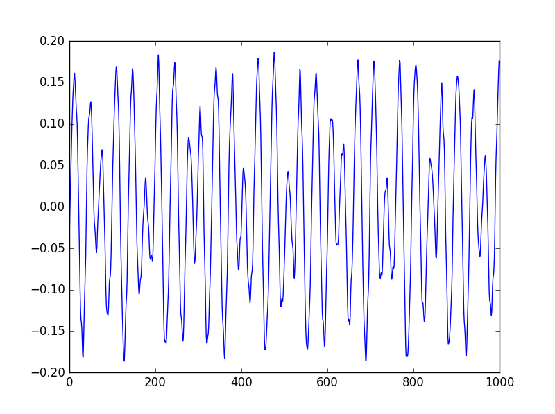

# Entrega 1 - Projeto 2 - DTMF

Esta etapa do projeto consiste na construção de um código que gera tons utilizados na telefonia moderna (<i>encoder</i>) e um código que recebe e salva esses tons (<i>decoder</i>), utilizando o sistema <i>Dual-Tone Multi-Frequency</i> (DTMF).

## Descrição da geração e da frequência dos tons

Cada um dos tons correspondentes aos numeros de 0 a 9 é gerado com base em <b>duas frequências</b>, mostradas na tabela a seguir:

| Frequencia   | <b>1209 Hz</b>     | <b>1336 Hz</b> | <b>1477 Hz</b>  | <b>1633 Hz</b> |
|--------------|--------------------|----------------|-----------------|----------------|
| <b>697 Hz</b>|        1           |        2       |        3        |        A       |
| <b>770 Hz</b>|        4           |        5       |        6        |        B       |
| <b>852 Hz</b>|        7           |        8       |        9        |        C       |
| <b>941 Hz</b>|     <i>*</i>       |        0       |        #        |        D       |

Logo, para gerar o tom do número 7, é preciso somar as senoidais dadas por sen(2πft), sendo f as respectivas frequências e t o tempo dado com 44100 <i> steps </i>. 

## Comparação dos Gráficos

Nesta seção serão comparaados os gráficos das frequências enviadas pelo encoder e recebidas pelo decoder

 
