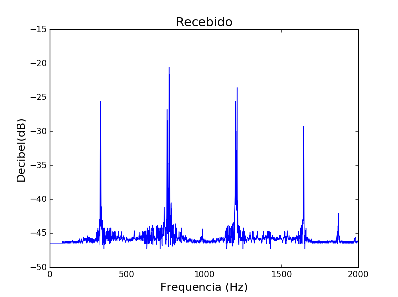

# Entrega 2

## Decoder

### Fourier dos Sinais

| Tom   | Sinal Transmitido       |Sinal Recebido        |
|:-----:|-------------------------|----------------------|
|1      |         |      |
|2      |         |      |
|3      |         |      |
|4      |         |      |
|5      |         |      |
|6      |         |      |
|7      |         |      |
|8      |         |      |
|9      |         |      | 
|0      |         |      |

### Divergências nas frequências enviadas e recebidas
| Tom   | Frequência Enviada (Hz) |Frequência Recebida (Hz)|
|:-----:|:-----------------------:|:----------------------:|
|1      |697, 1209                |697, 1210               |
|2      |697, 1336                |698, 1336               |
|3      |697, 1477                |698, 1477               |
|4      |770, 1209                |770, 1209               |
|5      |770, 1336                |769, 1335               |
|6      |770, 1477                |770, 1477               |
|7      |852, 1209                |851, 1208               |
|8      |852, 1336                |852, 1336               |
|9      |852, 1477                |851, 1476               | 
|0      |941, 1336                |941, 1337               |

As divergências ocorrem devido ao fato das transmissões não terem ocorrido em um ambiente ideal e totalmente silencioso, fazendo com que ruidos ocorressem. Além disso, o alto-falante utilizado para a transmissão e o microfone da recepção podem apresentar alguma erro ou desvio de frequência, divergindo da originalmente gerada pelo programa.

### Tempos utilizados

Para o encoder, foi utilizado tempo de 2 segundos para a reprodução do audio, enquanto para o decoder apenas 1 segundo para a recepção. Este periodo é mais que suficiente para a captação integral de um tom, além de ser curto suficiente para impedir a captação de muitos ruídos.
